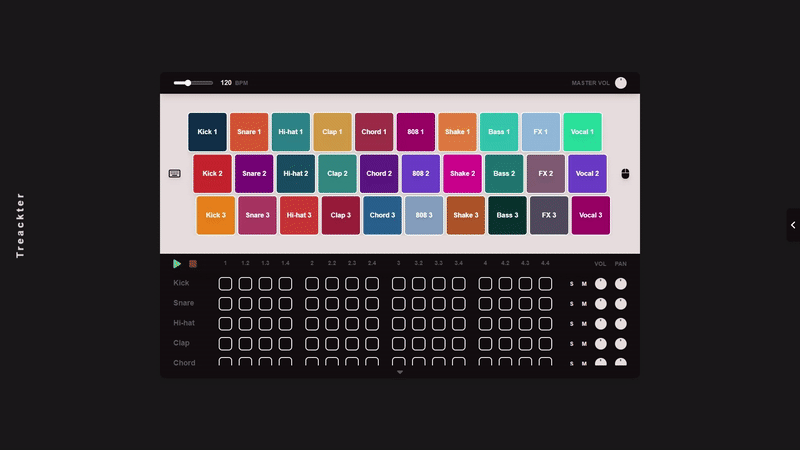

 

    
    <h1>Treackter</h1>
    <h3>Digital Audio Workstation</h3>

 

A react-based app for creating beats in your browser. 

Use your keyboard or mouse to play samples in the top **soundboard**. This will help you come up with ideas for creating a track!

In the bottom **timeline**, select which pads to activate in your four-bar loop. Each instrument can be soloed, muted and its volume & panning can also be adjusted with the knobs on the right.

To customize your beat, you can select a **BPM** that best suits your current idea. Also, the **master volume** can be modified in the same section.

Finally, you can name and save your project. This will generate a `.beat` file that can later be uploaded in the same page.

